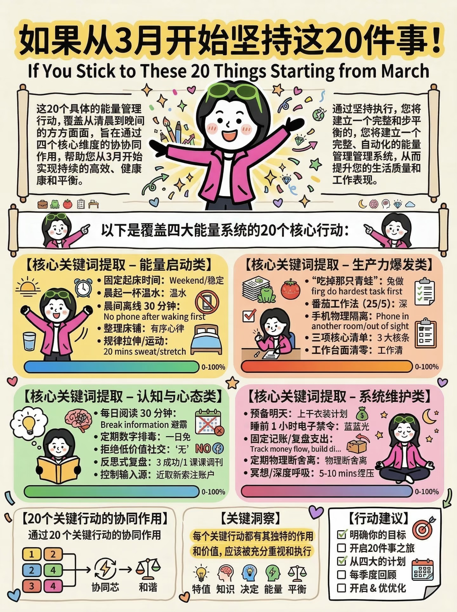

# Knowledge Card Journal Skill

把截图、笔记、链接、语音稿整理成阿甜风格的米色手帐知识卡。

这个 Skill 不是通用总结器。它更像一个创作者内容整理器：把散乱素材先压成一个清楚判断，再拆成 3-5 张可以发图、收藏、继续展开公众号的卡片。

## Search Keywords

English keywords:

`knowledge card`, `journal card`, `creator notes`, `visual note taking`,
`social media carousel`, `Xiaohongshu cards`, `RedNote content`,
`note to cards`, `AI skill for creators`, `content repurposing`,
`personal knowledge base`.

中文关键词：

`知识卡片`, `手帐卡片`, `小红书知识卡`, `小红书图文卡片`,
`截图整理`, `笔记整理`, `语音稿整理`, `内容卡片`, `知识库整理`,
`创作者素材整理`, `米色手帐风`.

## What It Does

输入可以很轻：

- 一段文字
- 一篇笔记
- 一组截图 OCR
- 一个内容链接
- 一段语音转文字
- 一个还没整理清楚的灵感

默认输出：

- 主题
- 核心判断
- 3-5 张知识卡片文案
- 风格备注
- 一句判断
- 下一步建议

它也支持把内容整理成一张 3:4 的高信息密度手帐海报结构。

## Why This Exists

很多创作者不是缺信息，而是缺结构。

截图很多，笔记很多，链接很多，收藏也很多，但最后这些素材经常没有变成可以发布的内容，也没有进入自己的知识库。

这个 Skill 解决的是一个很具体的小结果：

> 把散乱素材，变成能发、能存、能继续展开的知识卡片。

## Who It Is For

This Skill is useful for:

- creators who save many screenshots, links, and notes but struggle to publish them
- Xiaohongshu / RedNote operators who need card-ready copy
- newsletter and WeChat public account writers who want a compact visual outline
- personal knowledge-base builders who need short, reusable content blocks
- AI agents that need to turn messy input into a structured card set

It is intentionally not a generic summary tool. The output should be short
enough to become images, cards, or a compact knowledge-base note.

## Style

目标风格是阿甜的米色手帐系统：

- 奶油纸底
- 黑描边标题
- 彩色信息块
- 短标题
- 短句子
- 小贴纸和手写强调线
- 有判断，不堆信息

重点不是做得很漂亮，而是读者真的能看懂、能保存、能转成下一步内容。

## Visual Example



More example images:

- [life-20-things-02.jpg](assets/examples/life-20-things-02.jpg)
- [life-20-things-03.jpg](assets/examples/life-20-things-03.jpg)
- [life-20-things-04.jpg](assets/examples/life-20-things-04.jpg)
- [life-20-things-05.jpg](assets/examples/life-20-things-05.jpg)

## Example Prompt

```text
把这段原始内容整理成 3 到 5 张阿甜风格的米色手帐知识卡片。
```

或者：

```text
把这组截图内容做成一张高信息密度的 3:4 手帐海报结构。
```

## Input Examples

```text
这是一段语音稿，帮我压成 3-5 张小红书知识卡片。
```

```text
我有一组截图 OCR，内容很散，帮我整理成米色手帐风的卡片文案。
```

```text
把这篇文章整理成一张 3:4 高信息密度知识海报结构。
```

## Output Contract

```markdown
### 主题
...

### 核心判断
...

### 卡片 1
标题：
...

### 卡片 2
标题：
...

### 卡片 3
标题：
...

### 风格备注
...

### 一句判断
...

### 下一步
...
```

## Poster Mode

当内容更适合做成一张图，而不是多张卡片时，使用 poster mode。

适合：

- 方法类
- 清单类
- 结构拆解类
- 时间管理类
- 学习方法类
- 成长系统类

固定结构：

- 顶部标题区
- 引言判断区
- 4 个主体模块
- 人物与贴纸区
- 底部总结区

参考：[poster-template.md](references/poster-template.md)

## Files

- [SKILL.md](SKILL.md): Skill 主说明
- [agents/openai.yaml](agents/openai.yaml): OpenAI Agent 展示配置
- [references/test-case.md](references/test-case.md): 基础卡片案例
- [references/poster-template.md](references/poster-template.md): 海报结构模板
- [references/poster-case-commute.md](references/poster-case-commute.md): 通勤时间海报案例
- [examples/life-20-things](examples/life-20-things): 人生 20 件事示例素材

## RedSkill Angle

这个 Skill 适合包装成：

> 碎片素材变知识卡

免费版：

- 单段内容整理
- 3-5 张基础卡片
- 一种米色手帐风格

Pro 版：

- 批量截图整理
- 小红书发图版
- 公众号展开版
- 个人知识库分类
- 多套卡片模板
- 一键导出海报结构

## License

MIT
